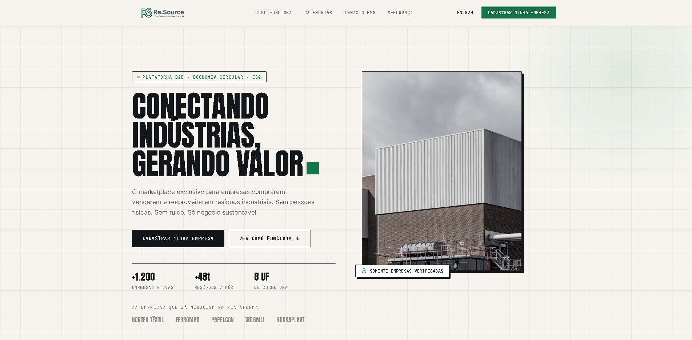
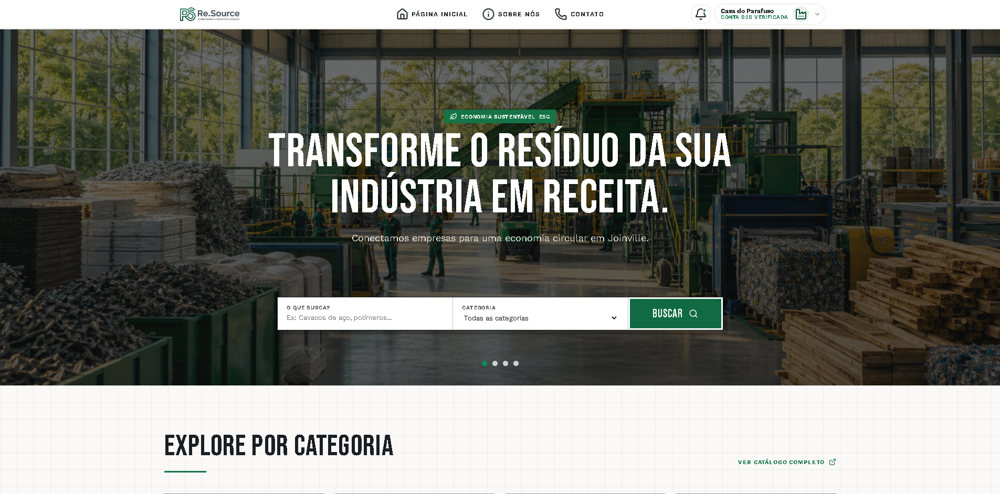
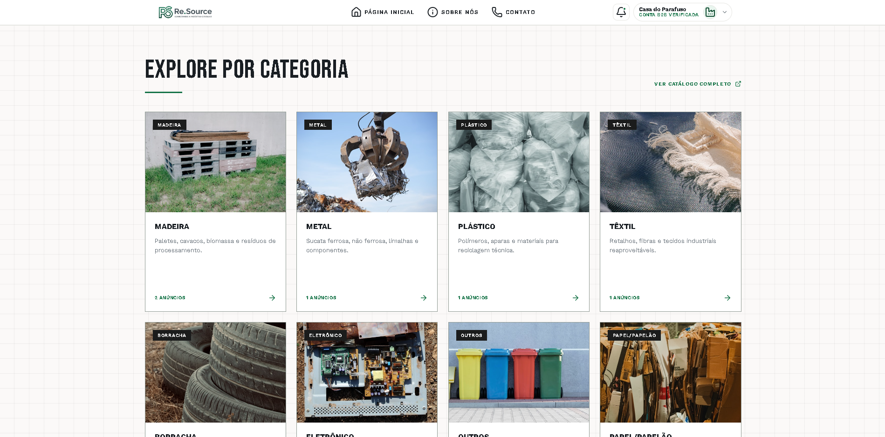
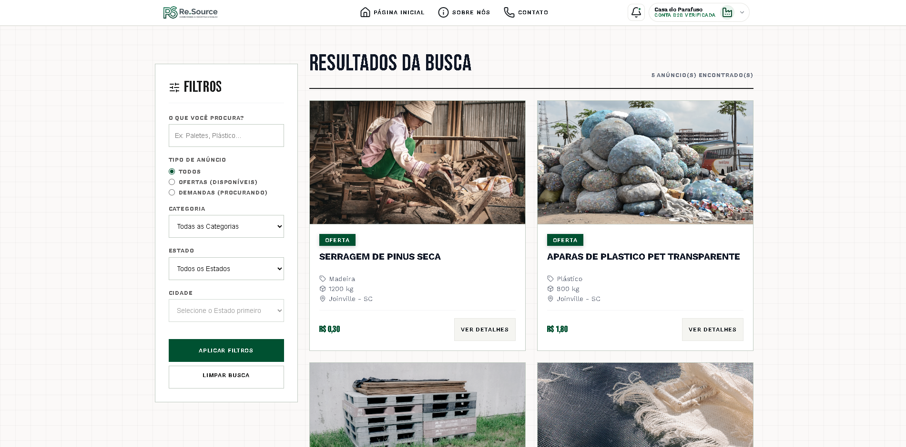
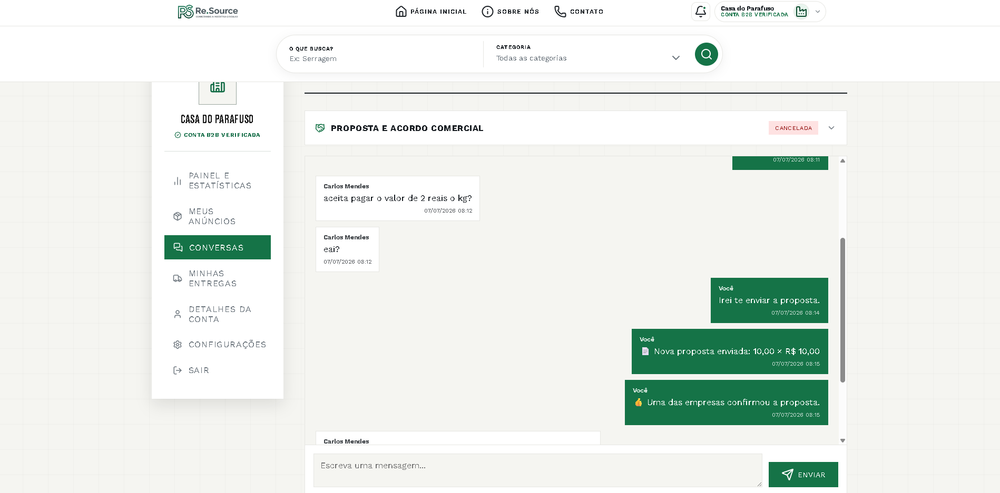
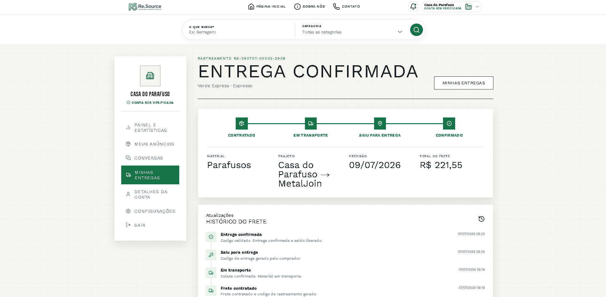
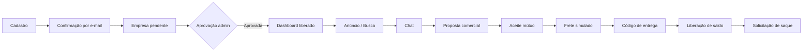

<div align="center">


# Re.Source

**Marketplace B2B para negociação de resíduos industriais** ♻️
Cadastro de empresas · Anúncios · Chat · Propostas · Frete simulado · Entrega por código · Saldo interno


-orange?style=for-the-badge)

[📸 Demo](#-demonstração-visual) · [✨ Funcionalidades](#-funcionalidades) · [🔄 Fluxo](#-fluxo-principal) · [🚀 Rodar](#-como-rodar-localmente) · [👥 Equipe](#-equipe)

</div>

---

## 📖 Sobre o projeto

O **Re.Source** é um MVP acadêmico que simula uma plataforma B2B onde empresas **anunciam, buscam e negociam resíduos industriais**, incentivando a **economia circular** e o reaproveitamento de materiais.

O foco é demonstrar o fluxo principal **de ponta a ponta**, de forma funcional e apresentável.

---

## 📸 Demonstração visual

<table>
  <tr>
    <td align="center"><b>Página inicial</b><br/></td>
    <td align="center"><b>Marketplace empresarial</b><br/></td>
  </tr>
  <tr>
    <td align="center"><b>Categorias de resíduos</b><br/></td>
    <td align="center"><b>Busca e anúncios</b><br/></td>
  </tr>
  <tr>
    <td align="center"><b>Chat e negociação</b><br/></td>
    <td align="center"><b>Acompanhamento de entrega</b><br/></td>
  </tr>
</table>

---

## ✨ Funcionalidades

<details open>
<summary><b>🏢 Para empresas</b></summary>
<br/>

- Cadastro com validação, confirmação por e-mail e status pendente
- Login de empresa pendente com navegação limitada
- Dashboard com métricas, categorias e anúncios
- CRUD de anúncios de resíduos
- Busca pública por texto, categoria e filtros básicos
- Chat entre empresas com contador de não lidas (polling)
- Propostas com quantidade, valor, prazo e responsabilidade pelo frete
- Aceite mútuo entre comprador e vendedor

</details>

<details>
<summary><b>🚚 Logística e pagamentos</b></summary>
<br/>

- Frete simulado com opções persistidas no banco
- Código de entrega de 6 dígitos com **hash**, validade, limite de tentativas e uso único
- Liberação interna de saldo após confirmação de entrega
- Solicitação de saque PIX/TED com aprovação ou recusa manual

</details>

<details>
<summary><b>🛡️ Painel administrativo</b></summary>
<br/>

- Aprovação, correção, rejeição, suspensão e reativação de empresas
- Gestão de anúncios, negociações, logística, saques e suporte
- Área de impacto ESG e configurações
- Termos de Uso e Política de Privacidade

</details>

---

## 🔄 Fluxo principal



---

## 🧰 Tecnologias

| Camada | Tecnologias |
|--------|-------------|
| **Back-end** | PHP 8+, PDO, arquitetura MVC |
| **Banco de dados** | MariaDB / MySQL |
| **Front-end** | HTML, CSS, JavaScript |
| **Testes** | PHPUnit |
| **Ambiente local** | XAMPP |

---

## 🗂️ Estrutura do projeto

<details>
<summary><b>Ver árvore de pastas</b></summary>

```
app/
  Controllers/      Controllers da aplicação
  Middleware/       Autenticação e autorização
  Services/         Serviços de domínio
  Views/            Telas e componentes PHP

config/             Configurações auxiliares (e-mail)
database/
  seeders/          Schema consolidado do banco
  inserts/          Dados de demonstração

public/
  css/ img/ js/     Estilos, imagens e scripts
  index.php         Entrada pública

routes/             Mapa de rotas
tests/              Testes automatizados
Docs/               Documentação acadêmica
```

</details>

---

## 🚀 Como rodar localmente

<details open>
<summary><b>⚡ Opção rápida — Windows + XAMPP</b></summary>
<br/>

Com o XAMPP instalado em `C:\xampp` e o Git no `PATH`, execute:

```bat
iniciar_ambiente.bat
```

O script clona o projeto, cria o `.env`, inicia MySQL e Apache, importa o schema e os dados de demonstração e abre `http://localhost/re.source`.

> Considera o MySQL padrão do XAMPP (`root` sem senha). Se você protegeu o usuário, ajuste os comandos `mysql` e `mysqladmin` no arquivo.

</details>

<details>
<summary><b>🛠️ Opção manual</b></summary>
<br/>

**1. Clonar**

```bash
git clone https://github.com/ddsc-sts/re.source.git
cd re.source
```

**2. Configurar o ambiente**

```bash
cp .env.example .env
```

```env
APP_URL=http://localhost/re.source
APP_BASE_PATH=/re.source

DB_HOST=127.0.0.1
DB_PORT=3306
DB_DATABASE=resource
DB_USERNAME=root
DB_PASSWORD=
```

Para testar e-mails, preencha também as variáveis SMTP.

**3. Importar o banco (phpMyAdmin, nesta ordem)**

```
1. database/seeders/re.sourcebanco.sql
2. database/inserts/create_admin.sql
3. database/inserts/empresa_demo.sql   (opcional)
4. database/inserts/produto.sql        (opcional, depende do 3)
5. database/inserts/saldo_demo.sql     (opcional, depende do 3 e 4)
```

**4. Acessar:** `http://localhost/re.source`

</details>

---

## 🔑 Contas de demonstração

> Credenciais fictícias, apenas para demonstração acadêmica.

<details>
<summary><b>Ver contas</b></summary>
<br/>

| Perfil | E-mail | Senha |
|--------|--------|-------|
| **Administrador** (`/admin`) | `admin@resource.com.br` | `Admin@2026!` |
| Empresa | `carlos@metaljoin.com.br` | `Resource@2026` |
| Empresa | `ana@madeirasul.com.br` | `Resource@2026` |
| Empresa | `roberto@plasticonord.com.br` | `Resource@2026` |
| Empresa | `fernanda@textilcat.com.br` | `Resource@2026` |
| Empresa pendente | `marina@empresapendente.com.br` | `Resource@2026` |

</details>

---

## 🧪 Testes

```bash
composer install
vendor/bin/phpunit        # Windows: vendor\bin\phpunit
```

Último relatório registrado: `OK (106 tests, 326 assertions)` ✅

---

## 👥 Equipe

<details>
<summary><b>Leonardo Becker</b> — Full-Stack e integração do MVP</summary>
<br/>

- Planejamento das prioridades e integração do fluxo principal
- Anúncios, busca, negociações, chat e propostas
- Aprovação de empresas, frete, entrega por código, saldo e saques
- Integração entre controllers, views, rotas e banco (MVC)
- Revisão funcional, testes manuais e preparação final do repositório

</details>

<details>
<summary><b>Daniel dos Santos</b> — Full-Stack, interface e qualidade</summary>
<br/>

- Estrutura inicial, banco de dados, cadastro, login, verificação por e-mail e recuperação de senha
- Migração para MVC e organização de páginas e componentes
- Redesign e evolução visual das telas
- Base dos fluxos de frete e entrega
- Criação e ampliação da suíte de testes com PHPUnit

</details>

<details>
<summary><b>Geder</b> (<code>Gedinn07</code>) — Front-end, administração e revisão</summary>
<br/>

- Padronização de CSS e ajustes de usabilidade
- Telas do painel administrativo (empresas, anúncios, negociações)
- Área de impacto ESG e elementos visuais
- Revisão geral de interfaces, textos e ícones

</details>

---

## 📄 Licença

Projeto acadêmico. Defina uma licença formal antes de reutilizar ou distribuir fora do contexto acadêmico.

<div align="center">

⭐ Gostou do projeto? Deixe uma estrela no repositório!

</div>
